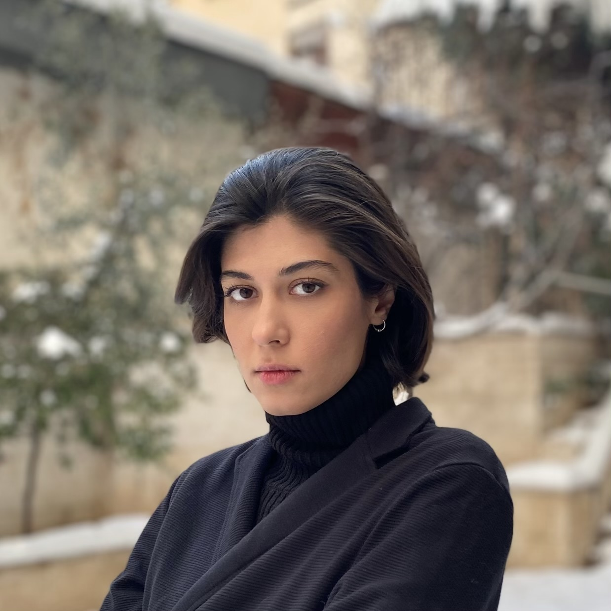

<h2>About Me</h2>

I am Fatemeh, a final-year physics student at Shahid Beheshti University, specializing in quantum machine learning within the Quantum Information and Computation Group. My passion for physics lies in its ability to connect the fundamental aspects of life and science, offering a unique perspective on the world. 

<h2>Interests</h2>
<li>Quantum Foundation</li>
	<li>Theoritical Condenced Matter Physics</li>
	<li>Quantum Machine Learning</li>
	<li>Mathematical Physics</li>
	<li>Quantum Computation (Design Patterns, Tests)</li>

