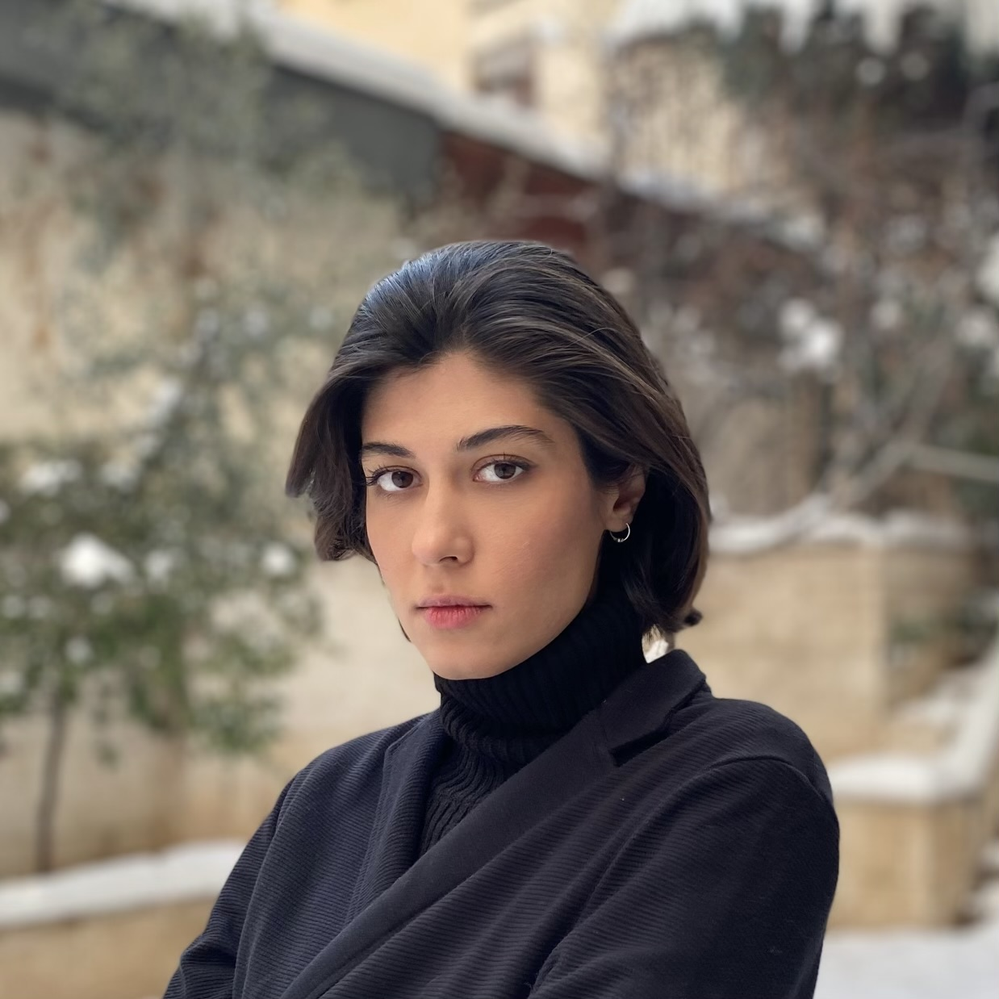

<h2>About Me</h2>

I'm a Master's student at the University of Cologne, originally from Tehran, Iran. My work sits at the intersection of quantum information, machine learning, and condensed matter physics—areas I believe will shape the future of computation and our understanding of reality.

During my Bachelor's at Shahid Beheshti University, I developed Quantum Restricted Boltzmann Machines under Dr. Halataei's supervision, achieving significant improvements in computational efficiency compared to classical frameworks. This research cemented my passion for quantum machine learning and problem-solving at the frontiers of physics.

I'm also deeply committed to education. Over two years as a Teaching Assistant for Physics and Solid State Physics, I've learned that clear communication and patience are as important as technical knowledge. Helping students grasp difficult concepts is work I genuinely love.

Now in Cologne, I'm eager to collaborate with new research groups, contribute to innovative lab work, and keep growing as a scientist. I'm actively seeking opportunities to apply my skills in quantum information and machine learning to challenging real-world problems. 

<h2>Interests</h2>
<li>Quantum Foundation</li>
<li>Theoritical Condenced Matter Physics</li>
<li>Quantum Machine Learning</li>
<li>Mathematical Physics</li>
<li>Quantum Information and Computation </li>

